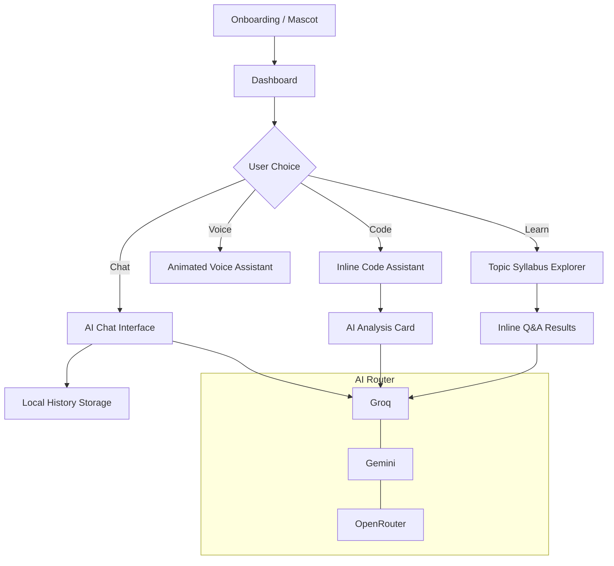

# Nexora AI: The Futuristic "Echo Mind" Assistant 🤖✨

Nexora is a premium, production-grade AI companion built for Android. It combines a high-end futuristic aesthetic with a robust multi-engine AI backend, designed to help developers and learners master complex technical topics through a unified, immersive interface.

---

## 🚀 Key Features

### 💎 Premium Visual Experience
*   **Futuristic UI**: Deep dark-purple design system with glassmorphism cards, neon gradients, and soft glows.
*   **Interactive Humanoid Mascot**: Meet "Echo Mind" on the onboarding screen. Tap to make him jump, or double-tap to see him slide forward to greet you.
*   **Cinematic Animations**: Smooth, high-performance transitions powered by Jetpack Compose and Motion graphics.

### 🧠 Intelligent "AI Router" Backend
Nexora is built for 100% uptime. It uses a triple-layered fallback strategy:
1.  **Groq (Primary)**: Lightning-fast responses using Llama 3.3.
2.  **Gemini (Secondary)**: Powerful fallback for deep reasoning.
3.  **OpenRouter (Tertiary)**: Broad model support ensuring a response is always delivered.

### 🎙️ Immersive Voice Assistant
*   **Real-time Detection**: Speak naturally; Nexora listens and processes your voice in real-time.
*   **Dynamic Visualizer**: An animated energy orb that changes states (Idle, Listening, Thinking, Speaking).
*   **TTS Integration**: Nexora speaks back to you, filtering out unwanted markdown signs for a natural dialogue.

### 🛠️ Specialized Developer Tools
*   **Code Assistant**: Paste code to **Explain, Debug, Optimize, or Generate Unit Tests** instantly without leaving the screen.
*   **Learning Hub**: Advanced level syllabus for Android, DSA, SQL, and System Design with inline technical deep-dives.
*   **Interview Mode**: Interactive tech interviews with final evaluations on technical knowledge, confidence, and correctness.

### 💾 Persistence & Synchronization
*   **Local History**: All chats are saved to a local **Room Database** with real-time search capability.
*   **Smart Settings**: Persistent user preferences (Haptic feedback, Wallpaper modes) managed via **Jetpack DataStore**.

---

## 🛠 Tech Stack

- **UI**: Jetpack Compose (100% Kotlin)
- **Architecture**: MVVM + Clean Architecture + Repository Pattern
- **Dependency Injection**: Dagger Hilt
- **Local DB**: Room Database
- **Preferences**: Jetpack DataStore
- **Networking**: Retrofit 2 + OkHttp 5
- **Image Loading**: Coil 3
- **Animations**: Compose Transitions + Infinite Animations
- **Voice**: SpeechRecognizer API + Text-to-Speech (TTS)

---

## 📊 Application Flow



---

## 📸 Screenshots

| Onboarding & Mascot | Dashboard | Chat Interface |
| :---: | :---: | :---: |
|  |  |  |

| Voice Assistant | Code Assistant | Learning Hub |
| :---: | :---: | :---: |
|  |  |  |

---

## 🛠 Setup & Installation

To run Nexora AI locally, you need to provide your own API keys.

1.  Clone the repository:
    ```bash
    git clone https://github.com/YOUR_USERNAME/NexoraAI.git
    ```
2.  Open the project in **Android Studio (Ladybug or newer)**.
3.  Create a `local.properties` file in the root directory.
4.  Add your API keys:
    ```properties
    GEMINI_KEY=your_gemini_key_here
    GROQ_KEY=your_groq_key_here
    OPENROUTER_KEY=your_openrouter_key_here
    ```
5.  Sync Gradle and Run!

---

## 👨‍💻 Developer

**Akash Yadav**
*   Passionate Android Developer focused on Premium UI & AI Integration.
*   GitHub: [@akashray398](https://github.com/akashray398)

---
*Note: This project was built to demonstrate advanced Jetpack Compose interactions, Clean Architecture, and seamless multi-provider AI integration.*
